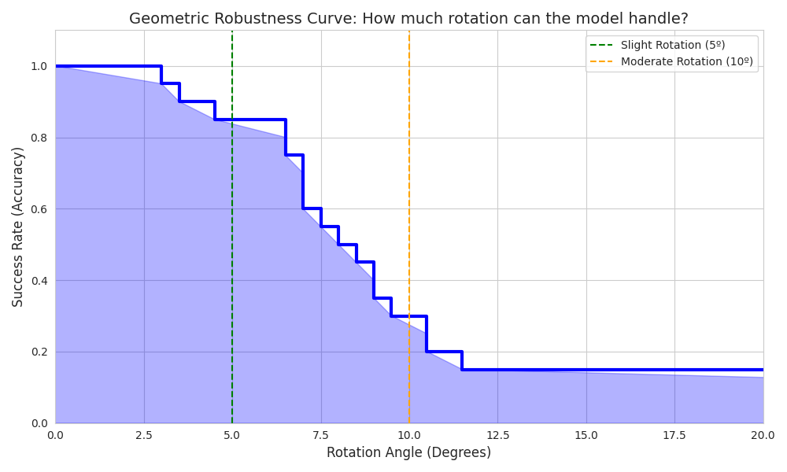
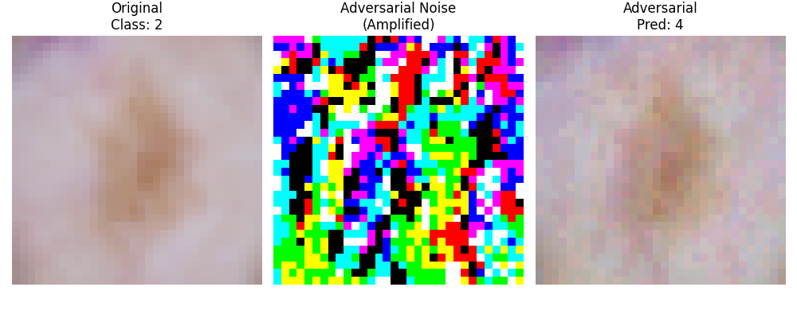

# Formal Verification & Robustness Analysis of Skin Cancer CNNs


##  Abstract
This project focuses on the **Safe and Verified AI** domain, specifically applied to **Medical Imaging** (Dermatoscopy). We analyze the robustness of a Convolutional Neural Network (CNN) trained on the **HAM10000** dataset to detect skin lesions.

Unlike standard accuracy metrics, we employ **Formal Methods (Bound Propagation)** and **Geometric Stress Testing** to certify the model's behavior against:
1.  **Global Illumination Changes:** Using Linear Relaxation based perturbation analysis (CROWN).
2.  **Geometric Transformations:** Assessing invariance to rotation.
3.  **Adversarial Attacks:** Evaluating vulnerability to FGSM (Fast Gradient Sign Method).

##  Key Features
* **Formal Verification:** Uses `auto_LiRPA` (CROWN algorithm) to mathematically certify safety regions around input images.
* **Geometric Robustness:** Empirical verification of rotation invariance using `Kornia` differentiable transforms.
* **Adversarial Defense:** Demonstration of model fragility via white-box attacks.
* **Advanced Visualization:** Generation of Survival Curves, Failure Heatmaps, and Risk Profiles (ECDF).

---

##  Experimental Results

### 1. Formal Verification (Lighting Invariance)
We define a safety property where the model must remain stable under global brightness perturbations ($\delta$). We use **CROWN (Linear Relaxation)** to compute the upper and lower bounds of the output logits.

* **Safety Collapse:** The model is certified safe for small perturbations ($\delta=0.0005$), but certification drops to 0% at $\delta=0.002$.
* **Bound Analysis:** We visualize the *worst-case* and *best-case* failure margins.

<p align="center">
  
  
</p>

### 2. Geometric Robustness (Rotation)
Medical images are rotation-invariant in nature (a lesion is the same regardless of camera angle). We tested the model's limits by incrementally rotating images until prediction failure.

* **Survival Curve:** Shows the percentage of images that maintain correct classification as rotation angle increases.
* **Findings:** The model is robust up to $\pm 5^\circ$, but performance degrades significantly beyond $\pm 15^\circ$.

<p align="center">
  
</p>

### 3. Adversarial Attacks (FGSM)
We implemented a white-box **Fast Gradient Sign Method (FGSM)** attack to demonstrate that imperceptible noise ($\epsilon=0.02$) can flip the diagnosis.

<p align="center">
  
</p>

---

## Project Structure

```text
├── code/
│   ├── verify_light.py         # Exp 1: LiRPA Formal Verification script
│   ├── find_rotation_limit.py  # Exp 2: Geometric Robustness Limit Search
│   ├── attack_fgsm.py          # Exp 3: Adversarial Attack Demo
│   ├── model_data_defs.py      # Model architecture and data loader
│   └── plotting_utils.py       # Comparison and visualization scripts
├── data/
│   ├── data_X.npy              # Preprocessed HAM10000 images
│   └── data_Y.npy              # Labels
├── plots/                      # Generated graphs (Heatmaps, Curves, Bounds)
├── results/                    # Raw text logs (Margins, Angles)
├── skin_model.pth              # Trained PyTorch Model weights
└── README.md

```

## Theory & References

* **LiRPA / CROWN:** Xu et al., *"Fast and Complete: Enabling High-Performance Neural Network Verification with Efficient CROWN"* (NeurIPS 2020).
* **FGSM:** Goodfellow et al., *"Explaining and Harnessing Adversarial Examples"* (ICLR 2015).
* **HAM10000 Dataset:** Tschandl et al., *"The HAM10000 dataset, a large collection of multi-source dermatoscopic images of common pigmented skin lesions"*.

---


